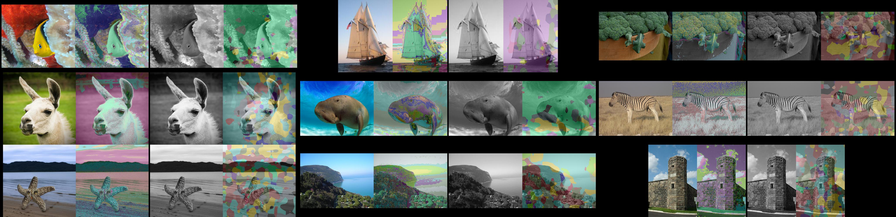

## Colorize FCN

Learn to colorize grayscale images using the FCN segmentation architecture.

### Setup

Install PyTorch and TorchVision in an Anaconda environment then install the dependencies (using conda) from the `environment.yml` file.

### Experiments

* **Tiny dataset** - sanity-checks by over-fitting an FCN-32s model from scratch on a dataset of 9 images. The command to train this network is `python train_color_fcn32s.py -g 0 -c 7 -b soft -k 32`. This trains the network to predict "color labels" (32 clusters in Hue-Chroma space) at each pixel given the single-channel Lightness image as input. The data paths set as defaults  can be changed in the training script. The results are saved under `./logs` with the latest timestamp. **Notes** - BatchNorm was needed to get any results. The current results visually are quite bad. 

[Color image | target clusters | grayscale image | predicted clusters ]

