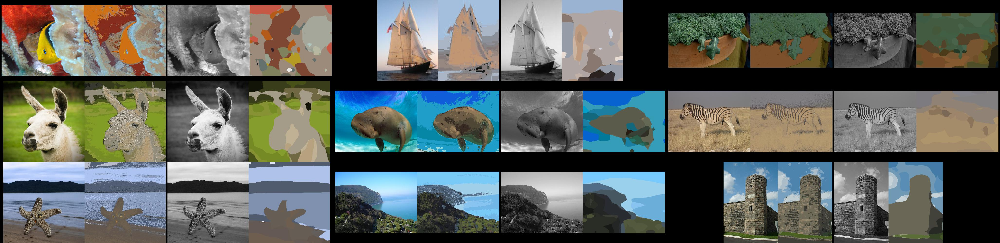
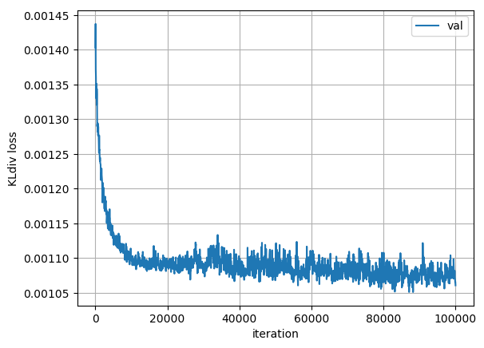
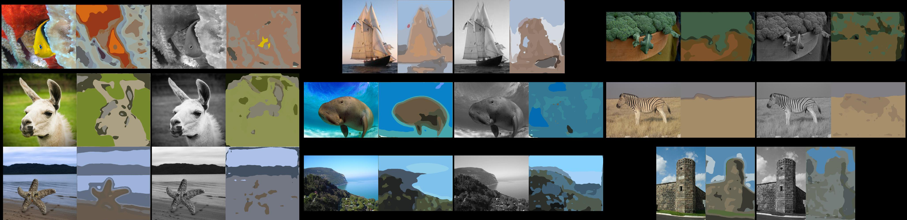
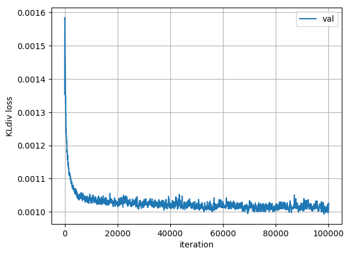
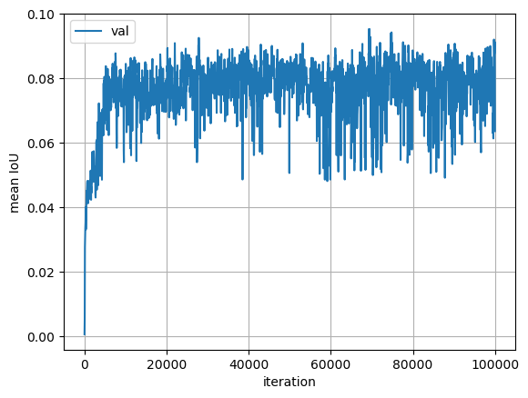
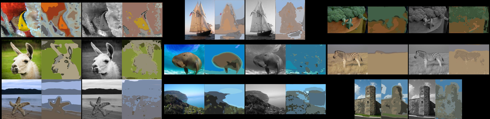
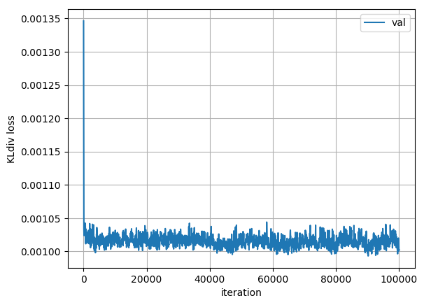
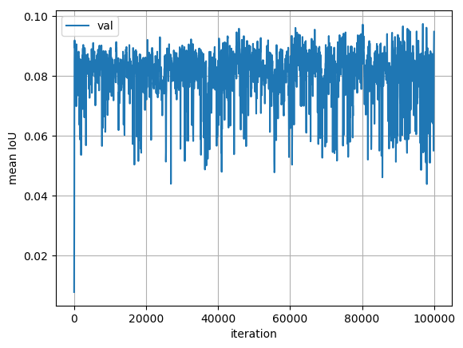

## Colorize FCN

Learn to colorize grayscale images using the FCN segmentation architecture.

### Setup

Install PyTorch and TorchVision in an Anaconda environment then install the dependencies (using conda) from the `environment.yml` file.

For 1080 GPUs, use: `conda install pytorch torchvision cuda80 -c soumith`.
This addresses the massive slowdown in executing `model.cuda()`.

### Usage

Experiment settings such as learning rates are defined in `config.py`, each setting being a key in a Python dict. Training FCN-32s is done first, using `train_color_fcn*s.py` and specifying a configuration number (the input args are explained in more detail inside the Python script).

The training metrics are updated in a log file saved under `logs/MODEL-folder/log.csv`. The loss and mean IoU on the validation set can be visualized by _manually_ calling `plot_log_csv(log_file_path)` from the `utils` module. Intermediate clustering results on 9 images are saved as a PNG image every 50 iterations by default, under `logs/MODEL-folder/visualization_viz`. 

### Experiments

* **Tiny dataset** - sanity-checks by over-fitting an FCN-32s model from scratch on a dataset of 9 images. The command to train this network is `python train_color_fcn32s.py -g 0 -c 7 -b soft -k 32`. This trains the network to predict "color labels" (32 GMM clusters in Hue-Chroma space) at each pixel given the single-channel Lightness image as input. The KL-divergence loss (PyTorch implementation) is used between GMM posteriors as targets and the network outputs. The data paths set as defaults  can be changed in the training script. The results are saved under `./logs` with the latest timestamp. **Notes** - BatchNorm, mean-centering input image,  Adam optimizer, fixed bilinear upsampler layer. 

For visualizing the labeled regions in the image, the _average RGB_ within each labeled region is used. 

[Color image | target clusters | grayscale image | predicted clusters ]

* **FCN 32s, lowpass, 100k, K=16** - Given that the FCN 32s model is by construction not designed for very fine-grained spatial segmentation (due to its large 32 pixel stride), we make the task easier by reducing the number of GMM color clusters to 16 and reducing the spatial resolution the target label mask by 8x. This makes the task simple enough for the network to train till convergence, and give rough _validation set_ results after 100k iterations. Cfg-14 in `config.py` is used. The IoU is very low, so the the next step is to use **FCN 16s** initialized with the current network.

[Color image | target clusters | grayscale image | predicted clusters ]

Validation Loss                       |  Validation Mean IoU
:------------------------------------:|:---------------------------------:
  |  

* **FCN 16s, lowpass, 100k, K=16** - Initialized FCN 16s from FCN 32s (best val performance model) trained in previous step. Experimental settings are as above (100k iterations using Adam, batchsize 1). Model definition in `models.py` and full training hyper-parameters are Cfg-15 under `config.py`. 

[Color image | target clusters | grayscale image | predicted clusters ]

Validation Loss                       |  Validation Mean IoU
:------------------------------------:|:---------------------------------:
  |  

* **FCN 8s, lowpass, 100k, K=16** -

[Color image | target clusters | grayscale image | predicted clusters ]

Validation Loss                       |  Validation Mean IoU
:------------------------------------:|:---------------------------------:
  |  

