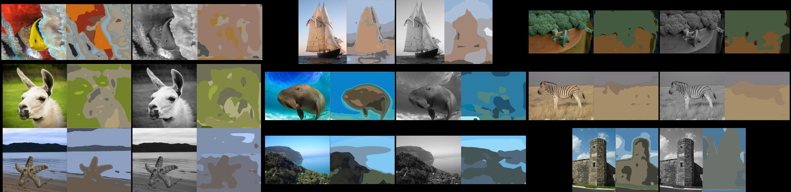
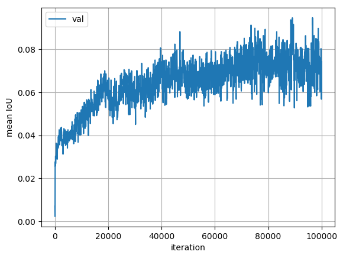

## Colorize FCN

Learning to colorize grayscale images using the FCN segmentation architecture. 
A lot of this code is based off a PyTorch implementation of FCN for segmentation: https://github.com/wkentaro/pytorch-fcn . 

:construction: **Under construction** :construction:

### Installation

* Install  if not already installed in the system.
* Create an Anaconda environment: `conda create -n resnet-face python=2.7` 
* Install PyTorch and TorchVision inside the Anaconda environment. 
    * First add a channel to conda: `conda config --add channels soumith`. 
    * Then install: `conda install pytorch torchvision cuda80 -c soumith`.
* Install the dependencies using conda: `conda install scipy Pillow tqdm scikit-learn scikit-image numpy matplotlib ipython pyyaml`

### Data setup

The  ILSVRC2012 train and val images need to be downloaded and extracted into "train" and "val" folders, similar to the folder structure shown below:

        Folder structure:
            .../ImageNet/images/
                |-- train/
                |-- val/
                |-- files_100k_train.txt
                |-- files_100k_val.txt
                |-- files_train.txt
                |-- files_val.txt
                |-- files-rgbvar-train.txt
                |-- files-rgbvar-train-1000-101000.txt
                |-- untarScript.sh

The txt files are available from . 

Each ImageNet image is transformed into the HSV colorspace, then to H, L and C (chroma), following the colorization method at https://github.com/gustavla/autocolorize. Note that no class-label information is used. This is done "under the hood" in the class defined in `data_loader.py`.

### Usage

The general code layout is described below. Specific examples of usage for a particular experiment will follow in subsequent sections of this readme.

* Experimental settings such as learning rates are defined in `config.py`, each setting being a key in a Python dict. Training FCN-32s is done first, using `train_color_fcn32s.py` and specifying a configuration number (the input args are explained in more detail inside the Python script).
* The evaluation metrics are updated in a log file saved under `logs/MODEL-folder/log.csv`. 
* The plots for training and validation loss and mean IoU can be generated by running `python -c "from utils import plot_log_csv; plot_log_csv('$LOG_FILE')"`, where LOG_FILE is the path to the CSV file.
* Intermediate colorization results on a subset of 9 validation images are saved as a PNG image every 50 iterations by default, under `logs/MODEL-folder/visualization_viz`. 

#### Sorted colorful images from ImageNet
:construction:
It may be easier for the network to train on more "colorful" images from ImageNet in the initial stages. We use the variance of RGB channels in an image as a proxy for measuring this "colorfulness". We can clearly see the increase in desaturated images in the later image montages below.

1-100 |   1k-100  | 10k-100  | 100k-100 | 200k-100 |
:----:|:---------:|:--------:|:--------:|:---------:
|   |  |  | 

Use `run_imagenet_bright_images.py`, after suitably modifying the paths specified in the script, to generate a list of ImageNet training set filenames, sorted by their RGB variance. The resultant text file, `files-rgbvar.txt` should be copied into the same folder as the ImageNet dataset 'train' and 'val' folders.

We can select a subset of these to train the network using shell commands, e.g.

    START=1000
    END=100100
    sed -n "${START},${END}p" files-rgbvar.txt > files-rgbvar-$START-$END.txt

**NOTE:** these lists should already be available from the `lists` sub-folder in this code repo.

#### Training
:construction:

---

### Experiments

Status guide -- :cyclone: - running code; :wrench: - working on it; :o: - todo; :white_check_mark: - completed, :black_square_button: - paused.

Implementing training variations:
* Target labels for estimating Hue and Chroma jointly
    - GMM soft bins :white_check_mark:
    - uniform binning - c.v. sigma :wrench:, voronoi regions :o:
* Training imagery
    -  100k randomly sampled from ImageNet train set :white_check_mark:
    -  Curriculum learning - using subset "bright-1" of colorful imagery :white_check_mark:

Current experiments **TODO** -list:
- GMM targets, standard training imagery :black_square_button:
- GMM targets, colorful training imagery :cyclone:
- Uniform bin targets, colorful training imagery :wrench:

---

### Experiments - first prototyping

* **Tiny dataset** - sanity-checks by over-fitting an FCN-32s model from scratch on a dataset of 9 images. The command to train this network is `python train_color_fcn32s.py -g 0 -c 7 -b soft -k 32`. This trains the network to predict "color labels" (32 GMM clusters in Hue-Chroma space) at each pixel given the single-channel Lightness image as input. The KL-divergence loss (PyTorch implementation) is used between GMM posteriors as targets and the network outputs. The data paths set as defaults  can be changed in the training script. The results are saved under `./logs` with the latest timestamp. **Notes** - BatchNorm, mean-centering input image,  Adam optimizer, fixed bilinear upsampler layer. 

For visualizing the labeled regions in the image, the _average RGB_ within each labeled region is used. 

[Color image | target clusters | grayscale image | predicted clusters ]

* **FCN 32s, lowpass, 100k, K=16** - Given that the FCN 32s model is by construction not designed for very fine-grained spatial segmentation (due to its large 32 pixel stride), we make the task easier by reducing the number of GMM color clusters to 16 and reducing the spatial resolution of the target label mask by 8x. This makes the task simple enough for the network to train till convergence, and give rough _validation set_ results after 100k iterations. Cfg-14 in `config.py` is used. The IoU is very low, so the the next step is to use **FCN 16s** initialized with the current network.

[Color image | target clusters | grayscale image | predicted clusters ]

Validation Loss                       |  Validation Mean IoU
:------------------------------------:|:---------------------------------:
  |  

* **FCN 16s, lowpass, 100k, K=16** - Initialized FCN 16s from FCN 32s (best val performance model) trained in previous step. Experimental settings are as above (100k iterations using Adam, batchsize 1). Model definition in `models.py` and full training hyper-parameters are Cfg-15 under `config.py`. 

[Color image | target clusters | grayscale image | predicted clusters ]

Validation Loss                       |  Validation Mean IoU
:------------------------------------:|:---------------------------------:
  |  

* **FCN 8s, lowpass, 100k, K=16** -

[Color image | target clusters | grayscale image | predicted clusters ]

Validation Loss                       |  Validation Mean IoU
:------------------------------------:|:---------------------------------:
  |  

* **FCN 32s, lowpass, full, K=128** -
